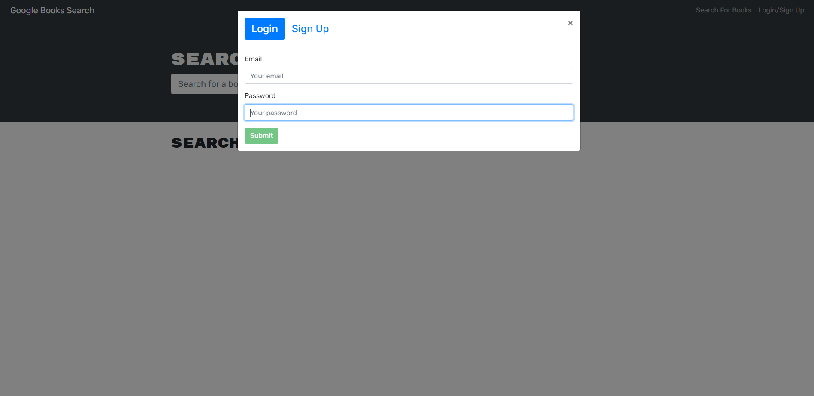

# book-search [](https://opensource.org/licenses/MIT)

## Table of Contents
* [Description](#description)
* [Installation](#installation)
* [Usage](#usage)
* [License](#license)
* [How to Contribute](#how-to-contribute)
* [Contact](#contact)

## Description
A book search application refactored from a RESTful API to use a GraphQL API and Apollo Server. Refactoring this code made me much more confident in my use of GraphQL, and I had a lot of experience with fixing small bugs in the code.

## Installation
Navigate to ```./book-search```

Run the following command from the terminal: 

```npm run install```

## Usage
This application is deployed to Heroku at [mels-book-search.herokuapp.com](https://mels-book-search.herokuapp.com/). 

To run the application for development on a local server, follow the following steps: 

1. Ensure MongoDB is installed and set up on your computer before using this application. A guide can be found [here](https://docs.mongodb.com/manual/installation/)

2. Navigate to ```./book-search```

3. Open a new terminal and run the following command:

```npm run develop```

Screenshots:




## License 
This project is covered under the MIT License: [](https://opensource.org/licenses/MIT)

## How to Contribute
Fork the repository or contact me using the details shown below

## Contact
Please feel free to contact me through GitHub or email, using the following details: 

Email: mel.jack.developer@gmail.com

GitHub: [meljack1](https://github.com/meljack1/)
